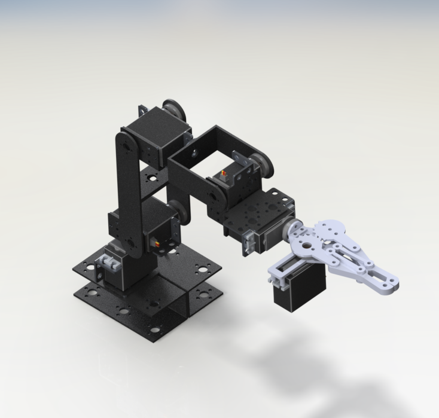
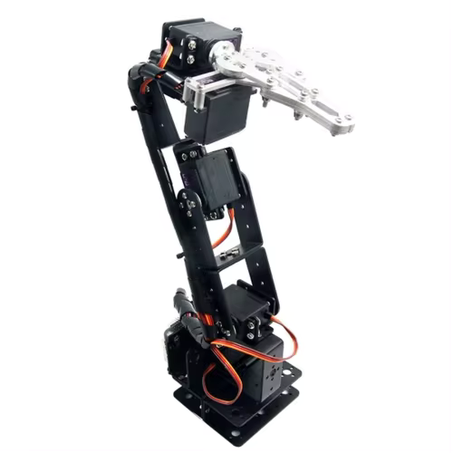
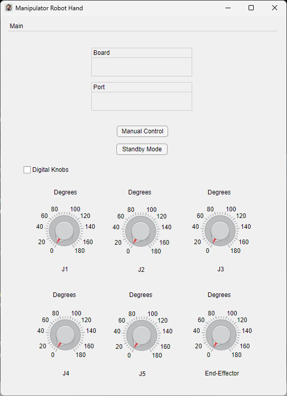

# Robotic Manipulator

This is a simple MATLAB App Designer application interface to manipulate manually or digitally a Robotic Manipulator Hand.

This Robotic Manipulator has six degrees of freedom. Its behaviour was analyzed with Denavit-Hartenberg Parameters.

## Table of Contents
- [Robotic Manipulator](#robotic-manipulator)
  - [Table of Contents](#table-of-contents)
  - [Project Description](#project-description)
  - [Hardware Used](#hardware-used)
  - [Software Requirements](#software-requirements)
  - [Prerequisites](#prerequisites)
  - [Installation Instructions](#installation-instructions)
  - [Usage](#usage)
  - [Features](#features)
  - [License](#license)
  - [Contact Information](#contact-information)
  - [Acknowledgements](#acknowledgements)

## Project Description
This project aims to provide an intuitive interface for controlling a robotic manipulator with six degrees of freedom. The interface allows for both manual and digital manipulation, making it versatile for various applications.

<p align="center">
  
</p>

## Hardware Used
<ul>
    <li>Arduino Uno</li>
    <li>Six Servomotors MG996R</li>
    <li>Voltage Power Supply: 7.2V and 2A</li>
    <li>Three Joysticks</li>
</ul>

## Software Requirements
I installed the <a href="https://la.mathworks.com/matlabcentral/fileexchange/47522-matlab-support-package-for-arduino-hardware" target="_blank">MATLAB Support Package for Arduino Hardware</a> to program with the Arduino Uno and I also used <a href="https://la.mathworks.com/products/matlab/app-designer.html" target="_blank">MATLAB App Designer</a> to build a user interface.

## Prerequisites
- MATLAB R2020a or later
- Arduino IDE

## Installation Instructions
1. Clone the repository:
    ```sh
    git clone https://github.com/yourusername/robotic-manipulator.git
    ```
2. Open MATLAB and navigate to the cloned repository.
3. Install the required MATLAB support packages:
    - <a href="https://la.mathworks.com/matlabcentral/fileexchange/47522-matlab-support-package-for-arduino-hardware" target="_blank">MATLAB Support Package for Arduino Hardware</a>
    - <a href="https://la.mathworks.com/products/matlab/app-designer.html" target="_blank">MATLAB App Designer</a>

## Usage
1. Connect the Arduino Uno and the servomotors as per the hardware setup.
2. Open the MATLAB App Designer and load the project.
3. Change the 'COM' and 'Arduino' values to match yours.
4. Run the application and use the interface to control the robotic manipulator.

<div style="display: flex; justify-content: center; align-items: center;">
  
  
</div>

## Features
- Manual and digital manipulation of the robotic arm
- Real-time control via MATLAB interface
- Easy setup and configuration

<!-- ## Contributing
Contributions are welcome! Please read the [contributing guidelines](CONTRIBUTING.md) first. -->

## License
This project is licensed under the MIT License - see the [LICENSE](LICENSE) file for details.

## Contact Information
For any questions or suggestions, please contact [manuel.pina.olivas@gmail.com](mailto:manuel.pina.olivas@gmail.com).

## Acknowledgements
- [MATLAB Central](https://www.mathworks.com/matlabcentral)
- [Arduino](https://www.arduino.cc/)